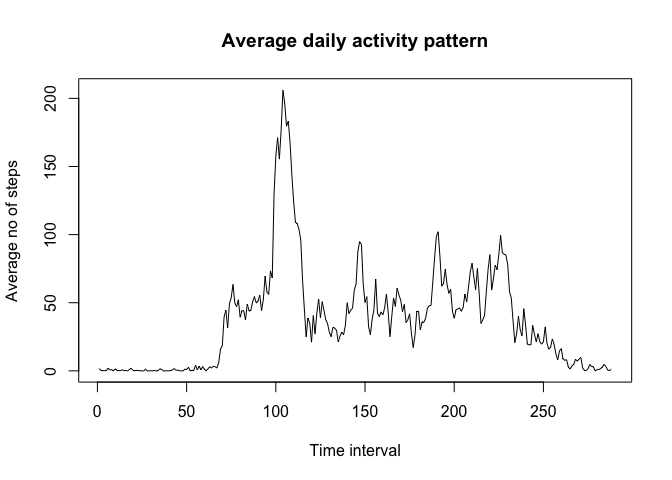
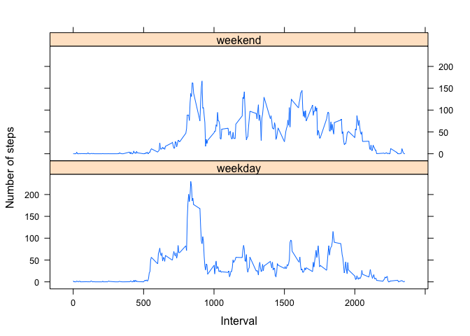

# Reproducible Research: Peer Assessment 1


## Loading and preprocessing the data

```r
library(lattice)
origdata <- read.csv("activity.csv")
# Remove NAs
data <- origdata[complete.cases(origdata),]
```

## What is mean total number of steps taken per day?

```r
daysum <- tapply(data$steps, data$date, sum)
hist(daysum, main="Histogram of steps per day", ylab="No of days", xlab="Steps")
```

 

```r
m <- mean(daysum, na.rm=TRUE)
med <- median(daysum, na.rm=TRUE)
```

The mean number of steps taken daily is 10766.19. The median is 10765.

## What is the average daily activity pattern?


```r
interval <- tapply(data$steps, data$interval, mean)
plot(interval,
     type="l",
     main="Average daily activity pattern",
     xlab="Time interval",
     ylab="Average no of steps")
```

 

```r
maxsteps <- max(interval)
msint <- origdata$interval[(1:288)[interval == maxsteps]]
```

Interval 835 contains the maximum average number of steps. On average the subject took 206.17 steps during this interval.

## Imputing missing values
Missing values will be replaced by the average for that interval across the 2
months.


```r
missingvals <- nrow(origdata) - nrow(data)

# Fill in missing values
# First take a copy of the original data that contains the NA values
fulldata <- origdata
# Set the NA values to the corresponding calculated interval default value.
fulldata$steps[is.na(origdata$steps)] <- as.integer(interval)

daysum <- tapply(fulldata$steps, fulldata$date, sum)
hist(daysum, main="Histogram of steps per day", ylab="No of days", xlab="Steps")
```

 

The histogram above shows data with NA values filled in with default values. We
can see that the middle column is higher because the days where all the data was
missing are now represented in this column - since they were replaced with
average values.


```r
m <- mean(daysum, na.rm=TRUE)
med <- median(daysum, na.rm=TRUE)
```

After replacing the missing values with the interval average over 2 months, the mean number of steps taken daily is 10749.77. The median is 10641. These values are very close to the original mean and median values.

Missing values can skew the result. For example if we have many values missing in the sleeping period where we would normally record 0 steps, the result would skew upwards. By filling the values with the average for that interval we get better results.

## Are there differences in activity patterns between weekdays and weekends?

```r
# Add column for day type (weekday or weekend)
fulldata$daytype <- c("weekend",
                      "weekday",
                      "weekday",
                      "weekday",
                      "weekday",
                      "weekday",
                      "weekend")[as.POSIXlt(fulldata$date)$wday + 1]

# Calculate weekday average steps
intervalwd <- tapply(fulldata$steps[fulldata$daytype == "weekday"],
                     fulldata$interval[fulldata$daytype == "weekday"],
                     mean)

iv <- data.frame(interval = as.numeric(names(intervalwd)), steps = intervalwd, daytype="weekday")

# Calculate weekend average steps
intervalwe <- tapply(fulldata$steps[fulldata$daytype == 'weekend'],
                     fulldata$interval[fulldata$daytype == 'weekend'],
                     mean)

ivwe <- data.frame(interval = as.numeric(names(intervalwe)), steps = intervalwe, daytype="weekend")

# Bind the weekend and weekday data frames
df = rbind(iv, ivwe)

xyplot(steps ~ interval | daytype,
       data = df,
       layout = c(1, 2),
       type = "l",
       xlab = "Interval",
       ylab = "Number of steps")
```

 

By comparing the results from weekends and weekdays we can see significant differences.

Some examples are:

- The subject appears to wake up at the same time every day on weekdays. On weekends the timing varies as can be seen by a gradual slope.
- On weekends there is more activity during the middle of the day, on weekdays there comparatively more activity in the morning.
